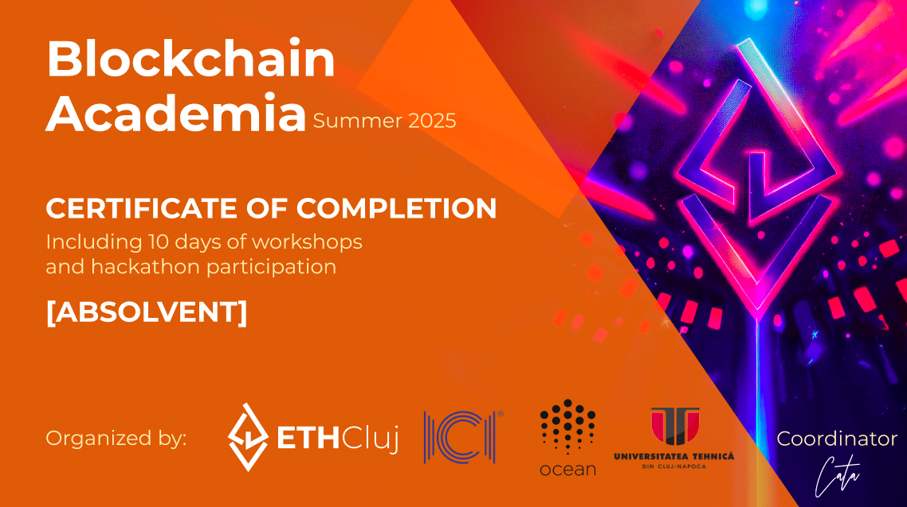
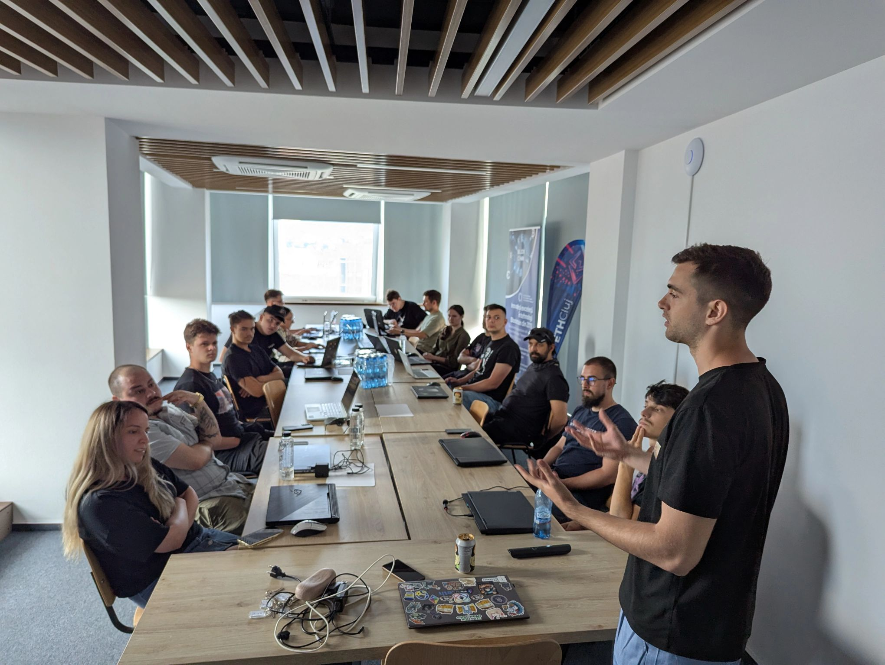
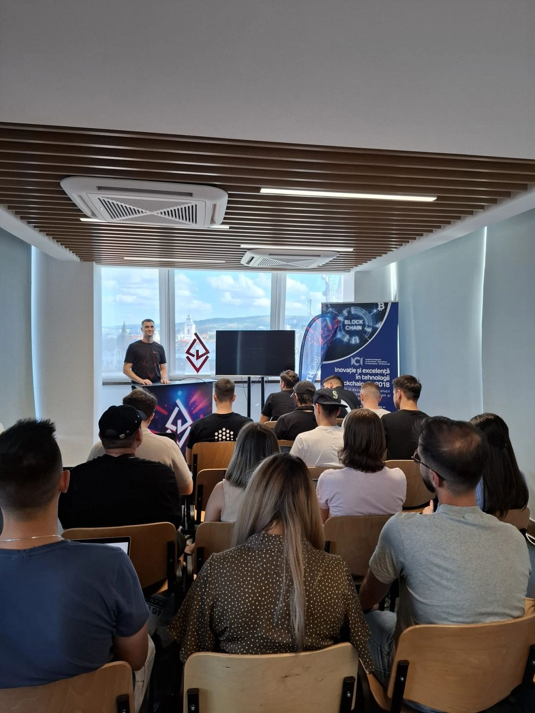
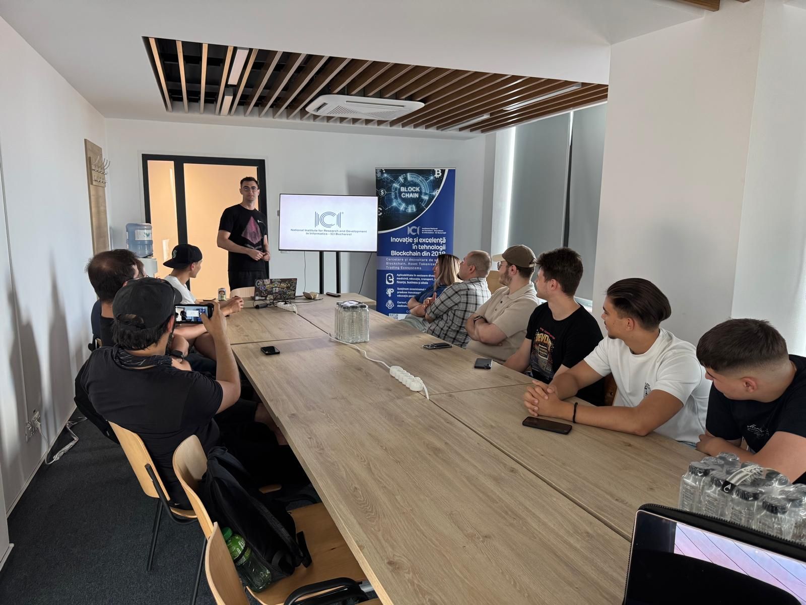

# Blockchain Academia - Summer 2025

## 📚 About the Summer School

The Blockchain Academia Summer 2025 was hosted in Cluj-Napoca at the UTCN Hub. The program covered **philosophy, technology, and business** aspects of blockchain, and was conducted in a hybrid format: **synchronously onsite** and **asynchronously "offsite"**.

Students learned fundamental concepts about the Ethereum Blockchain, including:
- 🛠️ **Coding** smart contracts
- 🚀 **Deploying** decentralized applications
- 💰 **DeFi** (Decentralized Finance) principles
- 📖 **Use cases** and real-world applications

The final days of the program were dedicated to a **public goods hackathon**, where participants worked to find innovative blockchain solutions for Romania.

## ❓ Questions?

For any questions, please contact the coordinator: [Catalin Balut](https://www.linkedin.com/in/catalin-balut-9102ab188/)

---

## 👥 Participants & Projects

| Participant | Project |
|------------|---------|
| Vonica Ioan-Paul | [Volunteer ID](#volunteer-id) |
| Tatarau Oana | [LifeChain / Emergency Medical Records on the Blockchain](#lifechain--emergency-medical-records-on-the-blockchain) |
| Muntian Mariana-Ionela | [LifeChain / Emergency Medical Records on the Blockchain](#lifechain--emergency-medical-records-on-the-blockchain) |
| Munduca Ioana Alesia | [BrickSafe](#bricksafe) |
| Țânț Rareș | [BrickSafe](#bricksafe) |
| Calin Ciobanu-Szedlak | [BrickSafe](#bricksafe) |
| Radu Carabat | [dPIV](#dpiv) |
| Maior Catalin | [ContaPrima](#contaprima) |
| Olariu Ioan-Paul | [ContaPrima](#contaprima) |
| David Nagy Elek | [Pay It Forward](#pay-it-forward) |
| Stîna Gabriel Marian | [Pay It Forward](#pay-it-forward) |
| Ionescu Anda | [MedChain](#medchain) |
| Tulvan Stefan | [Blockchain Fines Office (Ghiseu Amenzi pe Blockchain)](#blockchain-fines-office-ghiseu-amenzi-pe-blockchain) |
| Palasan David | GoalFi |
| Luca Miron | GoalFi |

---

## 🎓 Diplomas

All absolvents received **NFT Diplomas** and **Physical Diplomas** issued in partnership with **ICI Bucharest** and are recognized by **Ministerul Muncii** (Ministry of Labor).

The official diplomas can be viewed on OpenSea: [View Diplomas on OpenSea](https://opensea.io/collection/blockchain-academia-2025)

---

## 📸 Photos

| | | |
|:---:|:---:|:---:|
|  |  |  |

---

## 🚀 Hackathon Projects

### Volunteer ID
**Team Members:**
- **Vonica Ioan-Paul** - [LinkedIn](https://www.linkedin.com/in/ioan-paul-vonica-b21a6b23b/)

**Project Description:**

A blockchain-based digital identity system for volunteers that provides verifiable credentials and tracks volunteer activities, ensuring transparency and recognition of volunteer contributions.

**Project Links:**
- 📦 [GitHub Repository](https://github.com/DarkMysterio/BlockchainAcademia2025)
- 📊 [Presentation](https://github.com/DarkMysterio/BlockchainAcademia2025)

---

### LifeChain / Emergency Medical Records on the Blockchain
**Team Members:**
- **Tatarau Oana** - [LinkedIn](https://www.linkedin.com/in/oana-tatarau-564425356)
- **Muntian Mariana-Ionela** - [LinkedIn](https://www.linkedin.com/in/ionelamuntian)

**Project Description:**

A decentralized platform for storing and managing emergency medical records on the blockchain, ensuring secure, accessible, and tamper-proof medical data that can be quickly retrieved during emergencies.

**Project Links:**
- 📦 [GitHub Repository](https://github.com/ionelaMuntian/Blockchain_Emergency_Medical_Record)
- 📊 [Presentation](https://docs.google.com/presentation/d/1x5Z6yHFVd4ey3bXVjnAGvMtrWDkgNLEh/edit?slide=id.p12#slide=id.p12)

---

### BrickSafe
**Team Members:**
- **Munduca Ioana Alesia** - [LinkedIn](https://www.linkedin.com/in/munduca-ioana-alesia-27278ab5)
- **Țânț Rareș** - [LinkedIn](https://www.linkedin.com/in/rareș-țânț-93416220a/)
- **Calin Ciobanu-Szedlak** - [LinkedIn](https://www.linkedin.com/in/călin-ciobanu-szedlak-bb23ba217/)

**Project Description:**

A blockchain-based platform for real estate transactions and property management, providing secure, transparent, and immutable records of property ownership, sales, and rental agreements.

**Project Links:**
- 📦 [Frontend Repository](https://github.com/calin97/dreamTeam_FE)
- 📦 [Smart Contract Repository](https://github.com/calin97/BrickSafe_SC)
- 📊 [Presentation](https://docs.google.com/presentation/d/1UcB9nhzrMNrwbnNwa3B66dDVDauk7I84/present?slide=id.p1)

---

### dPIV
**Team Members:**
- **Radu Carabat** - [LinkedIn](https://www.linkedin.com/in/radu-carabat)

**Project Description:**

A decentralized Fourth Pillar of public investment that leverages blockchain technology to enable transparent, community-driven public investment initiatives, allowing citizens to participate directly in funding and decision-making for public projects.

**Project Links:**
- 📦 [GitHub Repository](https://github.com/raducarabat/dPIV)
- 📊 [Presentation (Figma)](https://www.figma.com/deck/urO9F0PUuzHBvjSaXJiYmA/Startup-Pitch?node-id=1-595&viewport=-158%2C396%2C0.73&t=1bx5ZMowief4o0tB-1&scaling=min-zoom&content-scaling=fixed&page-id=0%3A1)

---

### ContaPrima
**Team Members:**
- **Maior Catalin** - [LinkedIn](https://www.linkedin.com/in/maior-catalin-a31530217/)
- **Olariu Ioan-Paul** - No LinkedIn

**Project Description:**

A blockchain-based financial platform for account management and transactions, offering secure, transparent, and efficient digital banking solutions with smart contract automation.

**Project Links:**
- 📦 [GitHub Repository](https://github.com/MCatalin420/ContaPrima)
- 📊 [Presentation](https://docs.google.com/presentation/d/1iDzTBvkYDwWhhRIOKv1W1md5XKqsuAYc/edit?usp=sharing&ouid=108008457880464266935&rtpof=true&sd=true)

---

### Pay It Forward
**Team Members:**
- **David Nagy Elek** - [LinkedIn](https://www.linkedin.com/in/david-nagy-elek/)
- **Stîna Gabriel Marian** - [LinkedIn](https://www.linkedin.com/in/gabriel-stîna-b40960163?utm_source=share&utm_campaign=share_via&utm_content=profile&utm_medium=android_app)

**Project Description:**

A DeFi platform that enables peer-to-peer lending and charitable giving on the blockchain, allowing users to lend money or donate to causes while earning rewards and tracking impact transparently.

**Project Links:**
- 📦 [GitHub Repository](https://github.com/ttc915/Pay-It-Forward)
- 📊 [Presentation](https://www.canva.com/design/DAGuupentiY/XolSy_w54JiZujdMBzzNcw/edit)

---

### MedChain
**Team Members:**
- **Ionescu Anda** - [LinkedIn](https://www.linkedin.com/in/anda-ionescu-2a5389212/)

**Project Description:**

A blockchain-based healthcare platform for managing medical records, prescriptions, and patient data, ensuring privacy, interoperability, and secure sharing of medical information between healthcare providers.

**Project Links:**
- 📦 [GitHub Repository](https://github.com/AndaMaria7/Medchain/tree/main)
- 📊 [Presentation](https://prezi.com/p/edit/z2zn_gwak96v/)

---

### Blockchain Fines Office (Ghiseu Amenzi pe Blockchain)
**Team Members:**
- **Tulvan Stefan** - [LinkedIn](https://www.linkedin.com/in/stefan-tulvan-413884363)

**Project Description:**

A decentralized platform for paying fines and administrative penalties using blockchain technology, providing transparent, secure, and traceable transactions with automated verification and receipt generation.

**Project Links:**
- 📦 [GitHub Repository](https://github.com/st3chi/ghiseu-amenzi-blockchain)
- 📊 [Presentation](https://drive.google.com/file/d/1Ts1gJ_P83JLoxJq7w2D56HbAp1Ep5_Td/view?usp=sharing)

---

### GoalFi
**Team Members:**
- **Palasan David**
- **Luca Miron**

**Project Description:**

GoalFi is a Web3 platform that allows users to set personal goals, stake crypto, and receive rewards only if the goal is achieved, proven through NFTs.

**Concrete Example:**
Maria stakes 50 GOAL for a goal to lose 5kg in 2 months. The proof comes in the form of an NFT approved by a human/AI validator. She receives 100 GOAL as a reward.

